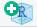
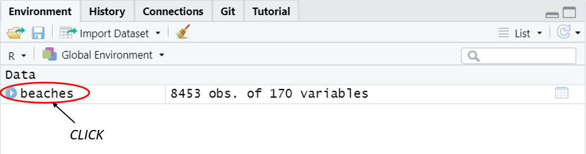
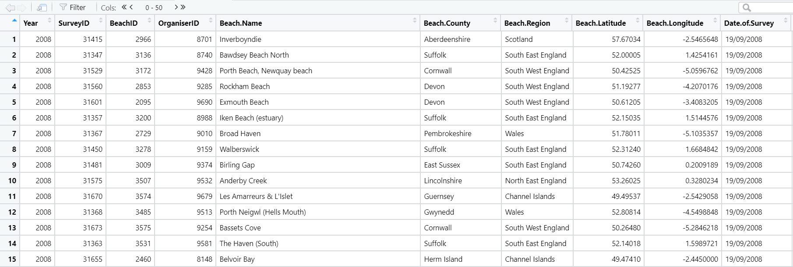
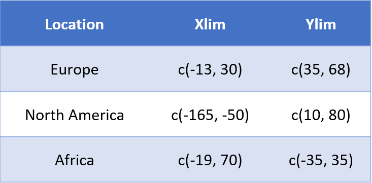
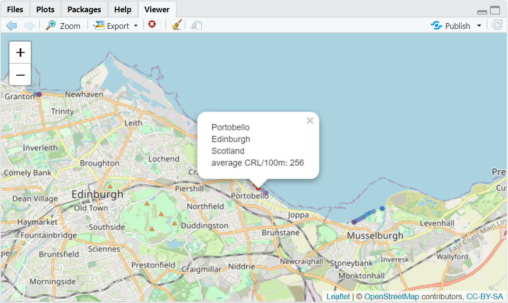

---

#### This tutorial is aimed at people who have some experience in using R and would like to try **spatial data visualisation** by using R as a GIS like software using specific packages. <br> <br> R is very powerful due to its wide applications in statistics, modelling, data visualisation and spatial data. In this tutorial we will be focusing on a specific type of spatial data: *point data*, and different ways to visualise it without diving into the theory behind more complex spatial objects such as lines and polygons.

#### This table summarises the key features of these different types of *vector data* 


#### If you are interested in other types of spatial data have a look at the supplementary material at the end of the tutorial.

#### There are many different ways to go about spatial mapping in R, and today you will learn one of these ways. <br> <br> To successfully plot spatial point data, the observations in the data frame must be associated with a set of X and Y coordinates which correspond to latitude and longitude.

#### In this tutorial we will be using a dataset from provided by the Marine Conservation Society which collates information from beach clean surveys carried out around the UK. The Great British Beach Clean is a volunteer initiative which encourages social engagement for conservation efforts. The data set includes count data collected for different litter categories for surveys between 2008 - 2018.

---

### Tutorial Aims
##### 1. Data preparation and wrangling for spatial visualisation
##### 2. Creating basic *static* maps with point data using ggplot2
##### 3. Creating *interactive* maps using the leaflet package

---

#### Here is a quick introduction to spatial data

[](https://www.youtube.com/watch?v=F7U-nJj9yUg)


---

#### Let's set up your project folder/ directory

Once you open Rstudio you need to create a project to include all of the files related to this tutorial by clicking on the create a project symbol  in the global toolbar at the top of an Rstudio window. Click on 'new directory' and 'new project', save the folder on your desktop and give it a descriptive name such as 'maps_tutorial'.

Your Rstudio project will open up and now you can create a new script by typing 'ctrl + shift + N' on windows or 'command + shift + N' on Mac or simply by using the global toolbar.

---

#### Downloading the files 

To download the necessary dataset you can clone or download the [repository](https://github.com/EdDataScienceEES/tutorial-giadaleone99) by clicking on the green 'Code' button and then clicking on 'download ZIP'. Next you can unzip the folder and move the data file 'beachwatch_data.csv' into the project folder/directory that you created previously. This data is provided by the [Marine Conservation Society](https://www.mcsuk.org/) as part of the Great British Beach Clean initiative.

---

#### Required packages

We will be using the ```tidyverse``` to do data wrangling and preparing the dataset, it also includes the ```ggplot2``` package which we will use for visualisation of point data.

The ```janitor``` package is a useful tool to clean datasets which will come in handy when handling public datasets which may have unorganised column names.

The ```leaflet``` package allows us to create interactive and informative maps.

If you have never used these packages before you will need to install them by using the ```install.packages("packagename")``` function and include the names within the "" before loading them with the ```library(packagename)``` function.

```{r, warning=FALSE, message=FALSE}
# Libraries ----
# install.packages("tidyverse")
   
library(tidyverse)  # Data wrangling & includes ggplot2
library(janitor)    # Cleaning datasets
library(ggthemes)   # Themes for ggplot2
library(leaflet)    # Interactive map
```

---

### Importing the dataset

Here we are importing the file 'beachwatch_data.csv' which you previously moved to your directory. We use the ```read.csv()``` function and assign the dataframe to object called 'beaches'. 

```{r, results='hide', echo=FALSE}
beaches <- read.csv("../data/beachwatch_data.csv")
str(beaches)  # Checking data structure
```

Note that if you previously saved the data file in a sub-folder you will have to specify the file-path to import the data. For example, if you moved the csv file to a folder names 'data' within the repository, you should write ```beaches <- read.csv(data/beachwatch_data.csv")```

```{r, eval=FALSE}
beaches <- read.csv("beachwatch_data.csv")
```

Now, let's have a look at the imported data by clicking on the object you created in your environment pane!



A new pane should open, and should look something like this



You should be able to scroll to the right and see some of the different categories of litter collected. Other important columns in the dataset include the year when the survey was carried out, where the beach is located such as region and county as well as specific beach longitude and latitude.

In the next section, we will be removing some of the columns we do not need, to declutter the data. We will be focusing on cigarette related litter and so we will keep the relevant rows.

---

### Preparing the data

Here we are organising the data by firstly cleaning the column names with the clean_names() function from the janitor package. It returns column names with lowercase letters and '_' separator.
Next we are deleting the unnecessary columns from the dataframe, from column 12-109 and from 112-170. We *keep* columns 110 and 112 because as we can see from the console output of the function ```colnames()``` these are the columns for cigarette packets and cigarette stubs. Lastly we drop columns which have NA values.


```{r, results='hide'}
# cleaning data frame column names
beaches <- beaches %>% clean_names() 

colnames(beaches)  # Viewing column names and associated column numbers

# deleting unused columns
beaches <- select(beaches,-seq(12, 109), -seq(112, 170))  

# dropping columns which have NA values
beaches <- drop_na(beaches)  

```

Changing data types: if variables are characters we are converting them to factors or 'categorical' data types, and if variables are integers we convert them to numeric. This is important for subsequent steps to work. R often requires variables to be a specific data type.

```{r, results='hide'}
str(beaches)  # Checking data types

# Changing data types
beaches <- beaches %>% mutate_if(is.character, as.factor) %>% 
                       mutate_if(is.integer, as.numeric)

```

---

### Creating a static map with ggplot2

Let's use ggplot to create a map to show us all the beaches around the UK which have data from Great British Beach Clean surveys.

We will gradually make this map step by step so you can follow the map making process.

```{r}
# Basic world map
ggplot() +                                # Calling ggplot()
   borders("world", colour = "black") +   # Plotting world borders in black
   theme_map()                            # map theme (no long & lat, white background )
```
<br>
Next, we will zoom in to the UK by setting the x and y limits within the ```coord_cartesian()``` function.

```{r}
# Zoom in to UK 
ggplot() +
   borders("world", colour = "black") +
   coord_cartesian(xlim = c(-10, 3), ylim = c(50.3, 59)) +  # specifying coordinates to zoom
   theme_map()
```

<br>

---

**TIP: If you would like to zoom into another country you can try playing around with the x and y lim values. However, here is a quick cheat sheet I have created to help you out! <br/> <br/>  {width=50%}** 

---

Now that we have zoomed into our area of interest, we can plot the points of the UK beaches surveyed in the dataset by specifying the coordinates (longitude and latitude) of our points within the ```aes()``` function.

We also filled the land with a lightgrey colour to make it stand out more and coloured the background blue.


```{r}
# Adding spatial data points (beaches)
ggplot(beaches, aes(x = beach_longitude,
                    y = beach_latitude)) +
   borders("world", colour = "black", fill = "lightgrey") +  # changing the colour of the map
   coord_cartesian(xlim = c(-10, 3), ylim = c(50.3, 59)) +
   geom_point(size = 1) +
   theme_map() +
   theme(panel.background = element_rect(fill = "aliceblue"))
```

We can see from the map that there is a rogue point in the West of Ireland! We can remove it by using the filter() function. The ```!=``` operator tells R 'is not equal to' so the function filters, and keeps all the observations except for the one where beach_region is not equal to 'Republic of Ireland'

```{r}
# Removing rogue point in Ireland 
beaches <- beaches %>% 
   filter(beach_region != "Republic of Ireland")  
```

Now, in the next map, the point will be gone!

In the code below we are telling ggplot to colour the points depending on beach region for which we have a column in the dataset.

```{r}
# Colouring points based on beach region
ggplot(beaches, aes(x = beach_longitude,
                    y = beach_latitude,
                    colour = beach_region)) +                  # Colouring by beach region
   borders("world", colour = "black", fill = "lightgrey") +  
   coord_cartesian(xlim = c(-10, 3), ylim = c(50.3, 59)) +
   geom_point(size = 1) +
   theme_map() +
   theme(panel.background = element_rect(fill = "aliceblue"))  # Changing background colour
```

We can see that the default location of the legend overlaps with the map, so we move the legend by specifying the ```legend.position()``` withing the theme function. Here we also add an informative title and change the legend title and box.

```{r}
ggplot(beaches, aes(x = beach_longitude,
                    y = beach_latitude,
                    colour = beach_region)) +
   borders("world", colour = "black", fill = "lightgrey") +  
   coord_cartesian(xlim = c(-10, 3), ylim = c(50.3, 59)) +
   geom_point(size = 1) +
   theme_map() +
   theme(plot.title = element_text(size = 12, hjust = 0.5, face = 'bold'),  # title characteristics
         panel.background = element_rect(fill = "aliceblue"),
         legend.position = c(0.77, 0.45),                      
         legend.box.background = element_rect(color = 'grey', size = 0.5)) +  # Adding a border
   labs(colour = "UK Regions",  # Changing legend title
        title = "Great British Beach Clean surveys in the UK")  # Informative title
```

That looks much better than it did before! Now, you have been equipped with some of the basic tools to create static maps with point data in ggplot. 

While maps like this can be very useful for reports, interactive maps offer the ability to make maps much more informative by including specifications for each of the points!

---

### Creating an interactive map with leaflet

In this section we will need to do some more data wrangling and synthesis in order to create an interactive map using the ```leaflet``` package.

Lets start by calculating beach average cigarette related litter (CRL) between 2008 - 2018.

To do this we will group by beach_id, then sum cig stubbs and packets and finally divide this by the number of surveys for that beach to obtain an average. 

Here we are going to create 2 separate data frames, so we can learn how to combine them by a common column using left_join().

```{r}
# Creating a dataframe with a column for total CRL
surveys <- beaches %>% 
   group_by(beach_id) %>% 
   summarise(total_crl = sum(paper_cardboard_cigarette_packets, paper_cardboard_cigarette_stubs)) %>% 
   ungroup() 

# Dataframe for number of surveys done for each beach (2008-2018)
num_surveys <- beaches %>% 
   group_by(beach_id) %>% 
   count(beach_id) %>% 
   ungroup()
```

Now we will merge these two data frames using the function left_join(). Since the two data frames have the 'beach_name' column in common, they are joined by that column.

```{r, message=FALSE}
combo <- left_join(surveys, num_surveys)
```


Now let's create a new column for average CRL using mutate() by dividing the total CRL by the number of surveys done for each beach --> average_crl.


```{r}
# Overwriting the combo data frame
combo <- combo %>% 
   mutate(average_crl = round(total_crl/n))  # Round to whole number
```

Now we can add this new informative data frame we have created to our 'beaches' data frame. We will call the object new_beaches so that we still have the original version of the data frame. 

```{r, message=FALSE}
# Creating a new dataframe with the extra information we calculated
new_beaches <- left_join(beaches, combo)
```

Now for the more interactive part! Here, we are using the leaflet function then ```addTiles()``` which adds the base map. Next we are specifying to ```addCircleMarkers``` (our beach locations) based on the new_beaches data frame and the specific latitude and longitude columns.

```{r}
leaflet() %>% addTiles() %>% 
   addCircleMarkers(data = new_beaches, lat = ~beach_latitude, lng = ~beach_longitude)

```

We can see from the output that points are too big and they are indistinguishable, so we can make them smaller by specifying the radius as shown in the code.

```{r}
# Adjusting point size
leaflet() %>% 
   addTiles() %>% 
   addCircleMarkers(data = new_beaches, lat = ~beach_latitude, lng = ~beach_longitude, radius = 1)
```

Now that we have made the points a reasonable size, you can try clicking on the points, as you can see nothing happens. We can actually create some 'pop-up' information to be displayed for the individual points. 

This can be done by pasting the contents of the specific columns followed by ```"<br/>"``` to get them on different lines.

```{r}
# Creating column to display data when points are clicked
new_beaches <- new_beaches %>% 
   mutate(popup_info = paste(beach_name, "<br/>", beach_county, "<br/>", beach_region, "<br/>", "average CRL/100m: ", average_crl ))

```

Now, in this map, you should be able to click the points and view the pop-up information which tells you the beach name, the county and the region as well as the average CRL count per 100m.

```{r}
# Adding the popup information to the map 
leaflet() %>% 
   addTiles() %>% 
   addCircleMarkers(data = new_beaches, 
                    lat = ~beach_latitude, 
                    lng = ~beach_longitude, radius = 1,
                    popup = ~popup_info)
```

We can also add some colour to the points so that beaches with higher average CRL counts per 100m can be identified more easily. 

First we need to specify the range of colours and create a colour palette. 

```{r}
colours <- c("#005AB5", "#DC3200")  # Lower and upper colours of palette
                                    # These are colour blind friendly

# Creating palette using above colours for average_crl
pal <- colorFactor(colours, new_beaches$average_crl)
```

Now that we have created this palette, we can add it to the interactive map. As you can see, now the beaches with the highest average CRL counts are represented by red dots and lower counts represented by light blue

```{r}
# Adding the coloured points to the map
leaflet() %>% 
   addTiles() %>% 
   addCircleMarkers(data = new_beaches, 
                    lat = ~beach_latitude, 
                    lng = ~beach_longitude, radius = 1,
                    popup = ~popup_info,
                    color = ~pal(average_crl)) 
```

And there is our final map!
If you zoom into edinburgh and find portobello beach, you can see that it has quite a high average count of cigarette related litter!




Well done for making it to the end of the tutorial, you are a champ!

If you are keen, you can go ahead and try to make some of your own maps with this dataset. You might want to try visualising the average number of volunteers that specific beaches have. This could be used to see where volunteer efforts could be increased with the option of reaching out to local schools to engage the youth.


--- 

### Supplementary material 
Here is an introduction to the different types of spatial data you could be working with in the future. 

[](https://www.youtube.com/watch?v=nVr4BC0C_oQ)

<br>

If you would like to learn more about these you can have a look at the coding club tutorial on [Geospatial Vector Data](https://ourcodingclub.github.io/tutorials/spatial-vector-sf/).

You can access more data from these sources

- https://datadryad.org/

- https://ourworldindata.org/ 

- https://livingplanetindex.org/data_portal

